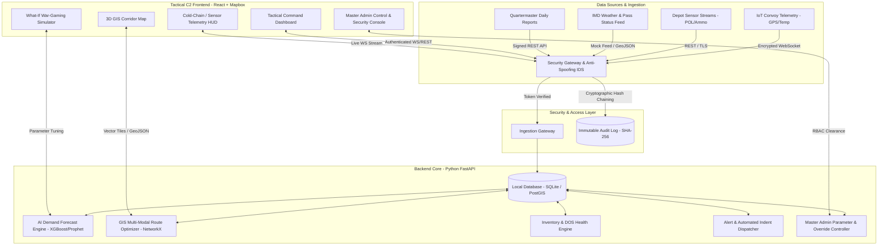
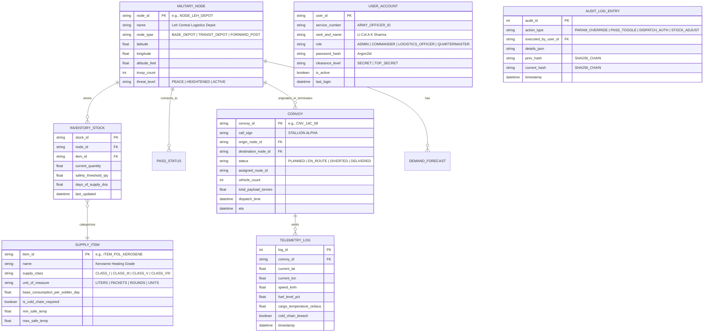
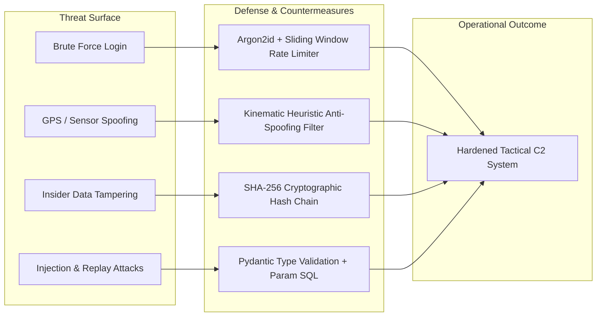

# System Architecture Document

## System Name: Project Rudra-Logistics
**Version:** 1.0.0  
**Target Deployment:** Air-gapped Tactical Operational Center (TOC) / Forward Logistics Depots

---

## 1. High-Level Architecture Overview

Project Rudra-Logistics follows a modular, decoupled architecture consisting of an **Ingestion & Telemetry Pipeline**, an **AI/Analytics Core**, a **Spatial/GIS Routing Engine**, and a **Tactical Command Frontend**.



---

## 2. Technology Stack Selection Rationale

| Component | Technology | Rationale for Military Context |
|---|---|---|
| **Frontend Framework** | React 18 + Vite + TailwindCSS | Fast load times, lightweight client bundle, easy component modularity. |
| **Tactical GIS / Maps** | Mapbox GL JS / Leaflet + Deck.gl | High-performance client-side vector rendering, offline mbtiles support, 3D terrain elevation. |
| **Backend Framework** | Python 3.11 + FastAPI | Async native (asyncio), high concurrency for telemetry, native integration with AI/ML and geospatial packages. |
| **Database** | SQLite with SpatiaLite / PostgreSQL with PostGIS | Standalone offline single-binary portability for prototype; enterprise PostGIS for production. |
| **AI / Machine Learning** | Scikit-learn, XGBoost, Pandas, NumPy | Low memory overhead, instant inference ($\le 20\text{ms}$), easily retrained on edge servers. |
| **Real-Time Streaming** | FastAPI WebSockets + Pydantic | Sub-second bi-directional telemetry transmission without cloud broker overhead. |

---

## 3. Database Schema Design (Entity Relationship Model)



---

## 4. REST & WebSocket API Contracts

### 4.1 GET `/api/v1/nodes/health`
Returns all military nodes with calculated Days of Supplies (DOS) and alert status.
```json
[
  {
    "node_id": "FOP_SIACHEN_BASE",
    "name": "Siachen Base Camp",
    "altitude_feet": 12000,
    "troop_count": 350,
    "temperature_celsius": -28.5,
    "overall_status": "CRITICAL",
    "inventory": [
      {
        "item_id": "ITEM_POL_KEROSENE",
        "name": "Bukhari Kerosene",
        "current_qty": 4200.0,
        "daily_burn_rate": 1400.0,
        "dos": 3.0,
        "status": "RED"
      },
      {
        "item_id": "ITEM_CLASS_I_RATIONS",
        "name": "High Altitude Rations",
        "current_qty": 6300.0,
        "daily_burn_rate": 350.0,
        "dos": 18.0,
        "status": "GREEN"
      }
    ]
  }
]
```

### 4.2 POST `/api/v1/routes/optimize`
Calculates optimal path taking active roadblock/hazard states into account.
- **Request:**
  ```json
  {
    "origin_node_id": "BASE_LEH_DEPOT",
    "destination_node_id": "FOP_SIACHEN_BASE",
    "blocked_passes": ["PASS_KHARDUNG_LA"],
    "cargo_priority": "CRITICAL_HEATING"
  }
  ```
- **Response:**
  ```json
  {
    "route_id": "ROUTE_BYPASS_SHYOK",
    "route_name": "Axis 2: Leh - Karu - Chang La - Agham - Nubra - Siachen",
    "distance_km": 284.5,
    "estimated_travel_time_hours": 9.2,
    "elevation_gain_m": 4200,
    "hazard_level": "MODERATE",
    "recommended_convoy_type": "4x4_ALS_WITH_SNOW_CHAINS",
    "path_coordinates": [
      [34.1526, 77.5771],
      [34.0253, 77.7423],
      [35.3214, 77.2012]
    ]
  }
  ```

### 4.3 WebSocket `/ws/telemetry`
Live streaming channel updating convoy GPS, vehicle health, and cold-chain temperature alerts every 2 seconds.

### 4.4 POST `/api/v1/admin/overrides/parameter`
Admin-only endpoint for modifying critical operational burn-rates or safety multipliers.
- **Request:**
  ```json
  {
    "parameter_name": "BUKHARI_HEATING_BURN_RATE_MULTIPLIER",
    "target_node_id": "FOP_SIACHEN_BASE",
    "new_value": 3.4,
    "authorization_token": "JWT_BEARER_SIGNED",
    "justification": "Extreme blizzard forecasted for next 72 hours"
  }
  ```
- **Response:**
  ```json
  {
    "status": "APPLIED",
    "audit_id": 1042,
    "sha256_hash": "e3b0c44298fc1c149afbf4c8996fb92427ae41e4649b934ca495991b7852b855",
    "message": "Parameter updated and appended to immutable audit chain."
  }
  ```

### 4.5 GET `/api/v1/security/audit-chain/verify`
Validates the cryptographic integrity of the entire supply chain audit trail.
- **Response:**
  ```json
  {
    "chain_length": 842,
    "tamper_detected": false,
    "latest_block_hash": "9f83c68a...7a2",
    "status": "CRYPTOGRAPHICALLY_VERIFIED"
  }
  ```

---

## 5. Air-Gapped & Offline Architecture

In military tactical sectors, commercial cloud infrastructure (AWS/GCP/Azure) is **prohibited for classified operations**.
1. **Self-Contained Edge Deployment:** The entire stack (React UI, FastAPI server, SQLite/PostGIS, ML weights) is packaged into a local Docker container or standalone executable.
2. **Local Mesh Sync:** Transit Depots run local server instances. When a convoy arrives at a transit camp, local WiFi/RFID or tactical UHF radios synchronize transaction logs peer-to-peer.
3. **No External CDN Dependencies:** All frontend icons, fonts (Inter/JetBrains Mono), and map tiles are bundled locally without fetching from external Google Fonts or CDN URLs.

---

## 6. Military Cyber Security & Anti-Hacking Framework



### 6.1 Cryptographic Audit Trail (Tamper-Evident Ledger)
To prevent rogue actors or supply diversions from cooking digital inventory logs:
- Every inventory increment, convoy authorization, or master override is structured as a transaction.
- Each transaction stores:
  $$\text{Current Hash} = \text{SHA256}(\text{Prev Hash} + \text{Timestamp} + \text{Officer ID} + \text{Action Data})$$
- If an adversary directly edits the local SQLite/Postgres database using external tools, the hash chain breaks instantly, triggering a **CRITICAL SYSTEM COMPROMISE** red lockdown on the Commander's C2 HUD.

### 6.2 Telemetry Anomaly & Anti-Spoofing Heuristics
Adversary Electronic Warfare (EW) units routinely deploy GPS spoofing near borders:
- **Kinematic Plausibility Check:** If a convoy jumps coordinates at an impossible speed ($> 90\text{ km/h}$ on mountain dirt passes) or reports negative altitude, the packet is flagged as `SPOOFED_TELEMETRY`.
- The system automatically ignores the spoofed blip and estimates dead reckoning position based on convoy last known speed and route plan.

### 6.3 Hardened Defense Against OWASP Top 10
- **SQL Injection (SQLi):** 100% prevented via SQLAlchemy ORM parameterized queries; raw SQL queries are strictly prohibited in the codebase.
- **Cross-Site Scripting (XSS):** React auto-escaping + strict Content Security Policy (CSP).
- **Session Hijacking:** JWT tokens stored in memory/HttpOnly secure cookies with short 15-minute expirations and cryptographic signature checks.

